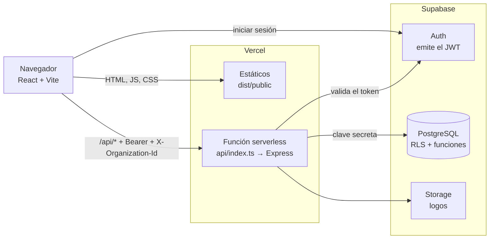
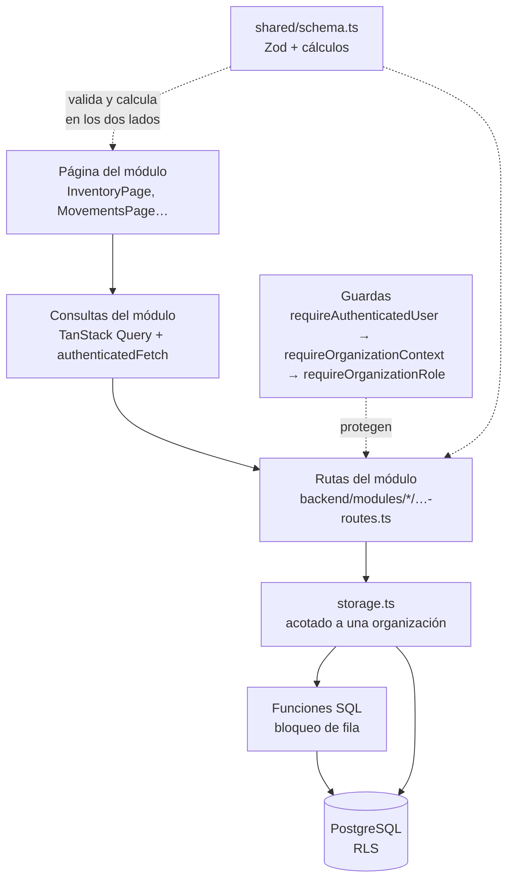
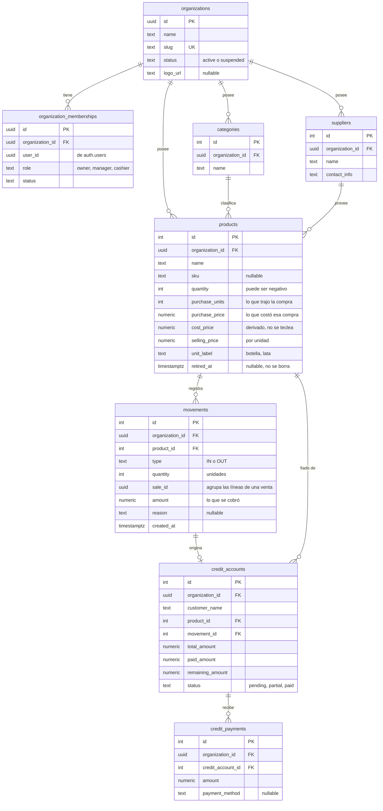
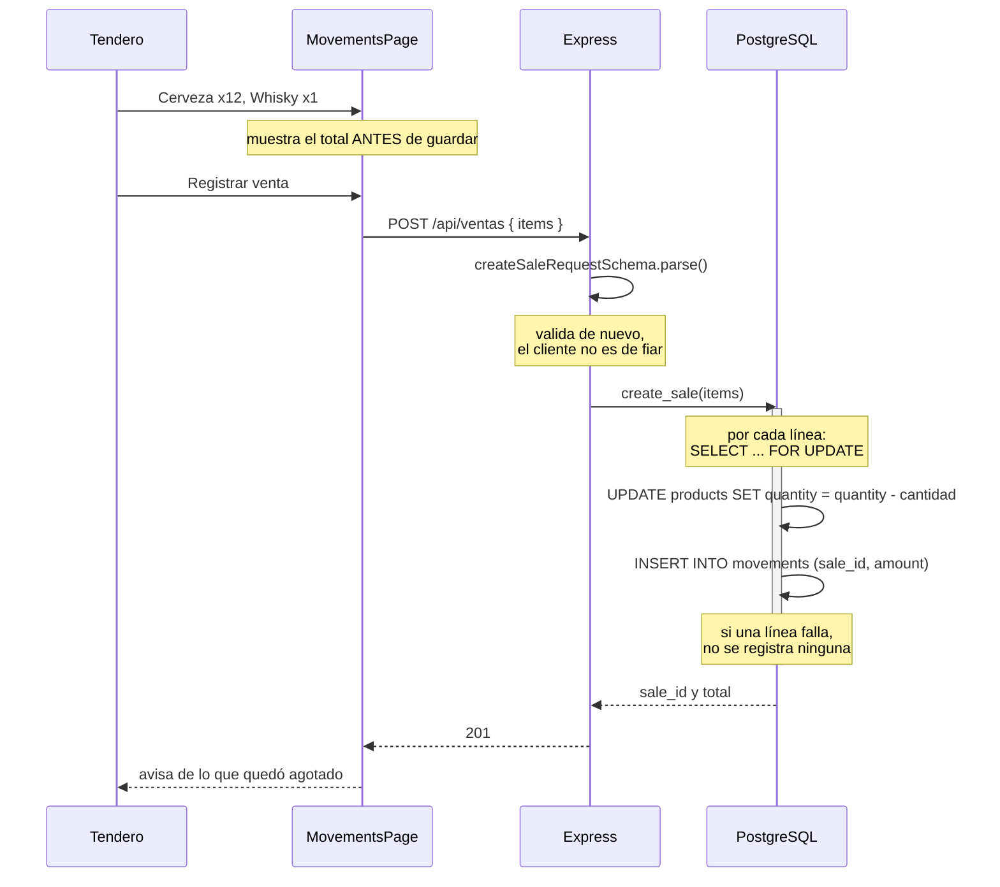
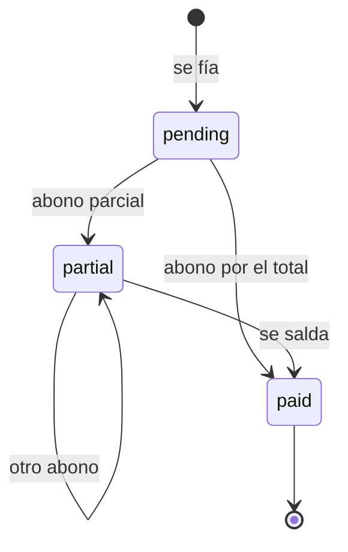
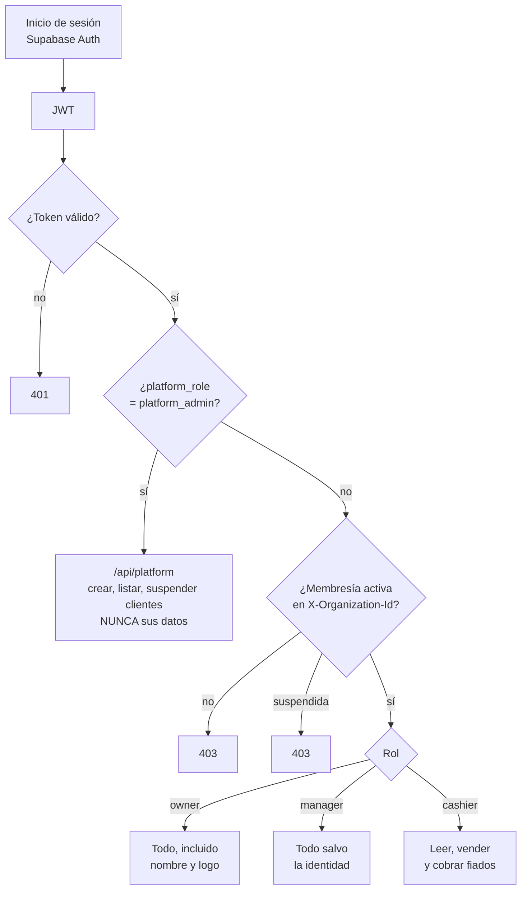

# Licorería Manager

Inventario y fiados para licorerías. Multiempresa, desplegado como una sola aplicación
en Vercel.

Cada licorería ve únicamente sus propios datos. Un administrador de plataforma da de alta
a los clientes con su propietario, sin acceder a lo que cada uno guarda.

---

## Índice

1. [Qué hace](#qué-hace)
2. [Stack](#stack)
3. [Arquitectura](#arquitectura)
4. [Modelo de datos](#modelo-de-datos)
5. [La lógica que importa](#la-lógica-que-importa)
6. [Seguridad](#seguridad)
7. [Empezar](#empezar)
8. [Base de datos y configuración](#base-de-datos-y-configuración)
9. [API](#api)
10. [Despliegue e integración continua](#despliegue-e-integración-continua)
11. [Pruebas](#pruebas)
12. [Convenciones](#convenciones)

---

## Qué hace

- **Inventario** — productos con costo, precio de venta, unidad, categoría y proveedor.
  Un producto se **retira**, no se borra: su historial de ventas sigue en pie.
- **La compra tal como llega** — anotas cuántas unidades trajo y lo que costó, como en la
  factura. El costo por unidad se calcula y se muestra: *"te sale a $0.71 cada cerveza"*.
- **Ventas** — eliges producto y cuántas unidades salieron, la cantidad que sea. Una venta
  puede llevar **varios productos**: cerveza, whisky y cigarrillos son un solo registro con
  su total, y la app lo muestra antes de guardarlo.
- **Fiados** — cuentas de crédito por cliente, vendidas igual que una venta al contado.
  Cada abono descuenta del saldo y la cuenta pasa a `partial` o `paid` sola.
- **Historial** — todo lo que entra y sale en una sola línea de tiempo, **incluidos los
  abonos de fiado**.
- **Catálogo** — categorías y proveedores, propios de cada licorería.
- **Panel** — total de productos, valor del inventario, productos agotados y actividad de
  los últimos siete días.
- **Mi licorería** — cambiar el nombre y subir el logo.
- **Clientes** — alta y suspensión de licorerías cliente. Reservado al administrador de
  plataforma, que no ve los datos de ninguna.

### Tres decisiones que parecen errores y no lo son

**El stock puede quedar negativo.** Nunca se bloquea una venta: si el tendero tiene la
botella en la mano, la vende. La app avisa **después** de que el producto quedó agotado,
en vez de impedirlo antes.

**Las compras no son un movimiento.** Lo que entra se anota corrigiendo el stock del
producto en Inventario. La pantalla de movimientos registra salidas.

**Una licorería tiene un solo usuario**, su propietario. No hay pantalla para añadir
personal.

---

## Stack

| Capa | Tecnología |
|---|---|
| Frontend | React 18, TypeScript, Vite 7, Tailwind CSS 3, wouter, TanStack Query v5 |
| Componentes | shadcn/ui sobre Radix, lucide-react, Recharts |
| Backend | Express 5 sobre Node 22, desplegado como función serverless |
| Datos | Supabase (PostgreSQL) con Row Level Security |
| Autenticación | Supabase Auth (JWT), validado en el servidor |
| Validación | Zod, con esquemas compartidos entre cliente y servidor |
| Tipos de la base | Generados desde el esquema real (`npm run types:db`) |
| Despliegue | Vercel — estáticos y API en el mismo proyecto |
| CI/CD | GitHub Actions |

---

## Arquitectura

### Un solo despliegue

Vercel sirve el frontend compilado como estáticos y ejecuta la misma app Express como
función serverless en `/api/*`. No hay backend alojado aparte.



**El navegador nunca consulta la base.** Solo usa Supabase para autenticarse; toda
lectura o escritura pasa por Express, que valida el token, resuelve la organización y
aplica el rol.

### Dos reglas que rompen el despliegue si se olvidan

- **ESM nativo.** Vercel ejecuta la función con el resolvedor de Node: todo import
  relativo necesita extensión `.js` y los alias de `tsconfig` **no se resuelven**. Un
  guard del CI falla si aparece uno sin extensión, porque el error solo se manifiesta
  en la función desplegada.
- **`VITE_*` se incrusta al compilar.** No se lee en tiempo de ejecución. Cambiar una
  de esas variables exige volver a compilar.

### Organización por módulo de negocio

No por tipo de archivo. Cada módulo agrupa lo suyo: su página, sus consultas, sus rutas
y sus esquemas.

```
api/index.ts              Entrada serverless. Importa backend/app.js de forma diferida
backend/
  app.ts                  createApp(), compartido por el servidor local y Vercel
  index.ts                SOLO servidor de desarrollo, con Vite. No se despliega
  auth.ts                 Autenticación y contexto de organización
  authorization.ts        Guardas por rol
  db.ts                   Cliente Supabase con la clave secreta
  database.types.ts       GENERADO. No editar a mano
  errors.ts               Traducción de errores a respuestas HTTP
  storage.ts              Acceso a datos, siempre acotado a una organización
  platform-service.ts     Alta de licorerías cliente y su propietario
  routes.ts               Ensamblador: salud, auth, contexto, y registra los módulos
  modules/                catalog · credits · inventory · organization · platform

frontend/src/
  App.tsx                 Rutas y guardas de sesión
  lib/                    Cliente Supabase, sesión, errores, borradores de formulario
  pages/                  Login, nueva contraseña, panel, 404
  modules/                catalog · credits · inventory · organization · platform
  components/ui/          Interfaz reutilizable, sin reglas de negocio
  components/layout/      Barra lateral
  hooks/                  Solo hooks de interfaz sin dominio, como use-toast

shared/                   schema.ts (Zod + Drizzle) · routes.ts · errors.ts · tenancy.ts
database/migrations/      Numeradas, se aplican en orden. Única descripción de la base
database/tests/           Comprobaciones sobre las funciones transaccionales
```

**Se importa siempre desde el módulo dueño.** `backend/routes.ts` es un ensamblador y no
debe acumular reglas de negocio; `frontend/src/components` y `frontend/src/lib` no deben
contener reglas de inventario, catálogo, fiados ni plataforma.

### Capas



`shared/` es lo que impide que cliente y servidor se contradigan: el mismo esquema de Zod
valida el formulario y la petición, y las mismas funciones calculan el total en la
pantalla y en el backend.

---

## Modelo de datos

Nueve tablas, una vista y seis funciones. **Toda tabla de negocio lleva
`organization_id`**, y las claves foráneas son compuestas `(id, organization_id)`: a
nivel de base de datos una fila no puede apuntar a otra de una licorería distinta.



**Vista:** `customer_debts`, resumen de deuda por cliente.

**Funciones:** `create_inventory_movement`, `create_credit_sale`, `register_credit_payment`
y `retire_product` hacen el trabajo transaccional; `is_active_organization_member` e
`is_platform_admin` sostienen las políticas de RLS.

### Por qué el producto guarda la compra y no el costo por unidad

La factura dice "24 cervezas, 17 dólares". Nadie lleva encima el 0,708.

- `products.purchase_units` y `purchase_price` — **lo que trajo la compra y lo que costó**,
  tal como viene en la factura.
- `products.cost_price` — **se deriva** (`purchase_price / purchase_units`) y no se acepta
  desde una petición. Aceptarlo dejaría el inventario valorado en algo distinto de lo que
  se pagó, y dos números que mantener de acuerdo en vez de uno.
- `products.selling_price` — lo que se cobra **por unidad**.

Hubo un modelo de presentaciones —cajas de 6, 12 y 24, cada una con su precio— y se
quitó. La licorería compra un lote y vende por unidad; la cantidad que sale de una vez
es la que el cliente pida. En toda la base llegó a existir **una sola presentación**, y
la creó una prueba.

---

## La lógica que importa

### Una venta lleva varios productos

Cerveza, whisky y cigarrillos son **una** venta, no tres. Cada línea es un producto y
una cantidad; el total es la suma, y se ve antes de guardar.

```
línea  = cantidad × precio_de_venta
total  = suma de las líneas
```

Las líneas de una venta comparten `movements.sale_id`, y cada una guarda en `amount` lo
que se cobró. **El importe se guarda** porque es un hecho del pasado: recalcularlo con
los precios de hoy da un número falso en cuanto alguien cambia uno.

### El camino de una venta, de la pantalla al stock



Cada producto se bloquea al leerlo, así que el precio con el que se cobra y el stock que
se descuenta salen de la misma lectura. **Media venta guardada sería peor que ninguna**,
por eso la función rechaza el lote entero si una línea está mal.

**La venta nunca se rechaza por falta de stock.** El aviso de agotado llega después.

### Un fiado es una venta que además abre una cuenta

`create_credit_sale` hace lo mismo que un movimiento y además crea la cuenta de crédito,
todo en una transacción. Cada abono descuenta del saldo y `register_credit_payment`
recalcula el estado.



### Historial unificado

`GET /api/movimientos/historial` devuelve movimientos y abonos **intercalados por
instante**. Las tablas no se mezclan: un movimiento siempre tiene producto y un abono
nunca, así que se leen por separado y se combinan al responder.

Es el único endpoint acotado por diseño: 50 registros por defecto, 200 como máximo.

### Quién puede hacer qué



El administrador de plataforma **también tiene su propia licorería**, aprovisionada
automáticamente, y ahí entra como `owner` igual que cualquiera.

---

## Seguridad

### Claves

| Variable | Qué es | Dónde vive |
|---|---|---|
| `SUPABASE_SERVICE_ROLE_KEY` | Clave **secreta** (`sb_secret_…`). Salta el RLS | Solo el servidor |
| `VITE_SUPABASE_ANON_KEY` | Clave **publicable** (`sb_publishable_…`) | Se incrusta en el bundle, es pública por diseño |
| `SUPABASE_ACCESS_TOKEN` | Token de la API de gestión, solo lectura | Solo el CI y tu máquina |

Las claves heredadas `anon` y `service_role` de Supabase están **desactivadas**.

Tres cosas impiden que la clave secreta se escape:

1. `vite.config.ts` **aborta el build** si `VITE_SUPABASE_ANON_KEY` no es publicable.
   Existe porque una vez llegó a compilarse dentro del bundle del navegador.
2. El servidor se niega a arrancar en producción sin `SUPABASE_SERVICE_ROLE_KEY`.
3. `.env` está en `.gitignore` y nunca estuvo en el historial.

**`SUPABASE_ACCESS_TOKEN` no debe poder leer `API Keys`.** Ese permiso da acceso a la
clave de servicio. Alcance **Project** sobre un solo proyecto y **dos permisos de
lectura**: `Project Settings` y `Database`. Nunca el preset `Read-only`, que incluiría
`API Keys`.

### Aislamiento entre licorerías

Es la propiedad que más caro sale perder, así que se defiende en cuatro capas:

1. **Columna.** Cada tabla de negocio lleva `organization_id` obligatorio.
2. **Consulta.** `backend/storage.ts` acota toda consulta a la organización del contexto.
   Hay un test que **falla el build si una consulta pierde ese filtro**.
3. **Base de datos.** Claves foráneas compuestas `(id, organization_id)` impiden que una
   fila apunte a otra de una empresa distinta, aunque el código se equivoque.
4. **RLS.** Activo en las nueve tablas, con los privilegios revocados para `anon` y
   `authenticated`.

Una organización **suspendida** queda sin acceso a la API.

### Roles

| Rol | Dónde vive | Qué puede |
|---|---|---|
| `platform_admin` | `auth.users.raw_app_meta_data.platform_role` | Crear licorerías cliente con su propietario, listarlas, suspenderlas. **No accede a los datos de ninguna** |
| `owner` | `organization_memberships` | Todo dentro de su licorería |
| `manager` | `organization_memberships` | Igual que `owner` salvo cambiar el nombre y el logo |
| `cashier` | `organization_memberships` | Leer, registrar ventas y cobrar fiados |

**En la práctica solo existe `owner`.** El alta de una licorería crea un único usuario y
no hay pantalla para añadir más. `manager` y `cashier` siguen en el tipo y en las guardas
porque el día que haga falta personal el andamiaje está; hoy nadie los usa.

Los roles de empresa **no viajan en el JWT**. La API resuelve la membresía en cada
petición contra la base, así que revocar un permiso surte efecto de inmediato y un claim
robado no sirve para escalar.

`requireOrganizationContext` construye el contexto **solo** a partir de una membresía
activa, y el tipo `OrganizationContext` únicamente admite roles de empresa: reintroducir
la excepción del administrador no compila. Tampoco puede suspender su propia licorería,
que lo dejaría fuera del panel desde el que se reactiva.

### Autenticación

- **Contraseñas:** mínimo **ocho caracteres** con al menos un número o un símbolo. La
  regla vive en `shared/schema.ts` y un test comprueba que el texto en pantalla coincide
  con lo que valida el esquema.
- **Sesiones en `sessionStorage`:** mueren al cerrar la pestaña y a los 30 minutos sin
  actividad. La caja suele ser una máquina compartida.
- **Recuperación de contraseña:** el enlace es de **un solo uso**. Los escáneres de correo
  lo consumen al previsualizarlo, así que la app detecta `otp_expired` y lo explica.

### Respuestas y registros

Los errores internos **no** se devuelven al cliente. Los registros contienen la línea de
la petición, **nunca el cuerpo de la respuesta** — antes se registraban enteras, lo que
enviaba nombres de clientes y saldos al almacenamiento de registros de la plataforma.

Cabeceras de la API: `nosniff`, `X-Frame-Options: DENY`, `Referrer-Policy`,
`Cache-Control: no-store` y `Strict-Transport-Security`. El HTML añade una Content
Security Policy desde `vercel.json`.

### Lo que a propósito no está

**Rate limiting.** Descartado. El inicio de sesión lo sirve Supabase, que trae el suyo;
lo que queda sin techo son las rutas de `/api` ya autenticado. En serverless un limitador
en memoria da falsa seguridad, porque cada instancia cuenta por su lado.

---

## Empezar

Node 22 (es la versión que usa el CI).

```bash
npm install
cp .env.example .env      # y rellena los valores
npm run dev               # http://localhost:5000
```

### Variables de entorno

```
SUPABASE_URL=https://tu-proyecto.supabase.co
SUPABASE_SERVICE_ROLE_KEY=sb_secret_...        # solo servidor
VITE_SUPABASE_URL=https://tu-proyecto.supabase.co
VITE_SUPABASE_ANON_KEY=sb_publishable_...      # va al navegador
SUPABASE_ACCESS_TOKEN=sbp_...                  # opcional, solo para npm run types:db
```

Las cuatro primeras están en Supabase → Settings → API Keys. En Vercel hay que
configurarlas **antes del primer build**: las `VITE_*` se incrustan al compilar.

### Scripts

```bash
npm run dev       # Servidor de desarrollo con Vite, puerto 5000
npm run build     # Compila el frontend a dist/public
npm run check     # Comprueba tipos
npm test          # Ejecuta los tests
npm run types:db  # Regenera backend/database.types.ts desde la base
```

Usa `npm run check`, no `npx tsc`: `npx` puede resolver otro TypeScript y fallar con
`TS5103` antes de compilar nada, lo que se parece mucho a «sin errores».

---

## Base de datos y configuración

En el SQL Editor de Supabase, ejecuta `database/migrations/` **por número**, de la `001`
a la última.

**No hay un volcado del esquema aparte.** Las migraciones son la única descripción de la
base; una segunda copia solo serviría para desviarse de ella sin que nadie lo note. El
esquema tampoco se sincroniza desde código: `drizzle-kit` y `db:push` se eliminaron porque
habrían borrado el RLS, las funciones y las claves foráneas compuestas. Drizzle solo
declara las tablas para que `drizzle-zod` derive los esquemas de validación; no consulta
la base.

Cada migración asume aplicada la anterior. Haz copia de seguridad antes de las que mueven
datos.

> **Aplica la migración antes de desplegar el código que la necesita.** Al revés rompe
> producción: ya pasó con una columna que el código pedía y la base todavía no tenía, y la
> app devolvía 500 a todo el mundo.

### Configuración de Supabase

En **Authentication → URL Configuration**:

- **Site URL** — la URL del despliegue
- **Redirect URLs** — esa misma URL con `/**`

Sin esto el enlace de recuperación lleva al sitio equivocado y **Supabase no avisa**:
acepta el `redirect_to` y cae en silencio al Site URL.

El correo integrado de Supabase está limitado a unos pocos envíos **por hora**. Con varias
licorerías reales pidiendo enlaces el mismo día, algunos no llegarán y no habrá error
visible. La solución es SMTP propio (Authentication → SMTP Settings), que necesita una
**clave SMTP**, no una API key, y un **dominio propio**: los correos gratuitos como
`@gmail.com` no se pueden autenticar.

### Tipos de la base

`backend/database.types.ts` **se genera, no se escribe**:

```bash
npm run types:db
```

Baja el esquema real desde la API de gestión de Supabase. No usa el CLI de Supabase a
propósito: son 30 MB y su formato de salida cambia entre versiones, lo que convertiría el
guard del CI en una fuente de falsas alarmas.

> **El token vence a los 90 días.** El actual se creó el **8 de septiembre de 2026**, así
> que hacia el **7 de diciembre de 2026** el paso del CI empezará a dar 401. El script lo
> dice explícitamente cuando pasa. Se renueva en Supabase → Account → Access Tokens y se
> repone en GitHub → Settings → Secrets and variables → Actions.

---

## API

Todo bajo `/api` exige `Authorization: Bearer <token>` salvo `/api/health`. Las rutas que
operan sobre datos de una licorería exigen además la cabecera `X-Organization-Id`.

| Método | Ruta | Quién |
|---|---|---|
| GET | `/api/health` | público |
| GET | `/api/health/database` | autenticado |
| GET | `/api/organizations/me` | autenticado |
| POST | `/api/account/password` | autenticado |
| GET | `/api/products`, `/api/products/:id` | miembro |
| POST, PUT, DELETE | `/api/products`, `/api/products/:id` | encargado |
| POST | `/api/ventas` | cajero |
| GET | `/api/movimientos/historial` | miembro |
| GET | `/api/categories`, `/api/suppliers` (y `/:id`) | miembro |
| POST, PUT, DELETE | `/api/categories`, `/api/suppliers` | encargado |
| GET | `/api/credits`, `/api/credits/stats`, `/api/credits/customer/:nombre` | miembro |
| POST | `/api/credits`, `/api/credits/payment` | cajero |
| GET | `/api/stats` | miembro |
| PATCH | `/api/organization` | propietario |
| PUT, DELETE | `/api/organization/logo` | propietario |
| GET, POST | `/api/platform/organizations` | administrador de plataforma |
| PATCH | `/api/platform/organizations/:id/status` | administrador de plataforma |

`DELETE /api/products/:id` **retira** el producto, no lo borra: su historial de ventas
sigue en pie.

---

## Despliegue e integración continua

`vercel.json` fija **build** `vite build`, **salida** `dist/public` y reescribe `/api/*`
a la función serverless; el resto sirve el SPA.

`.github/workflows/ci-cd.yml` corre en cada push y cada pull request. Además de instalar,
comprobar tipos, pasar los tests y compilar, **falla** si:

| Guard | Qué detecta |
|---|---|
| `npm audit --omit=dev` | Una dependencia que se publica tiene una vulnerabilidad conocida |
| Tipos al día | `database.types.ts` no coincide con la base. Se omite con aviso si Supabase no responde, o si no hay token |
| Imports sin extensión | Un import relativo sin `.js`, que rompería la función en Vercel |
| Hoja de estilos < 20 kB | Tailwind no encontró los archivos fuente |

Los dos últimos nacieron de fallos reales que pasaban tipos, tests y build sin quejarse y
solo se manifestaban en producción.

El job de despliegue está **inactivo** salvo que definas la variable de repositorio
`DEPLOY_VIA_ACTIONS` a `true`. Por defecto despliega la integración de Git de Vercel;
activar ambos duplicaría los despliegues.

**Keepalive.** `supabase-keepalive.yml` mantiene despierto el proyecto, que en el plan
Free se pausa tras una semana sin actividad. Consulta PostgREST con la clave publicable;
la migración 006 revocó todos los privilegios de ese rol, así que la respuesta esperada es
que **Postgres rechace la consulta** (`42501`). Ese es el punto: el error prueba que la
consulta llegó a Postgres, que es lo que cuenta como actividad. Necesita la variable
`APP_URL`.

### Verificar un despliegue

Vercel tarda **varios minutos** en propagar. Probar antes de tiempo da falsos negativos:
compara el hash del bundle desplegado con el del build local antes de juzgar.

```bash
L=$(ls dist/public/assets/index-*.js | head -1 | sed 's|.*/||')
B=$(curl -s "https://tu-app.vercel.app/" | grep -oE 'index-[A-Za-z0-9_-]+\.js' | head -1)
[ "$B" = "$L" ] && echo DESPLEGADO
```

Cuidado con las URLs de despliegue con hash (`tu-app-rcf9fclp0-…`): apuntan a un
despliegue **inmutable** y sirven código viejo para siempre.

---

## Pruebas

```bash
npm run check
npm test
npm run build
```

Los tests cubren los contratos de validación, el costo por unidad derivado de la compra,
el mapeo seguro de errores, las reglas de contraseña y **el filtro de organización en las
consultas**: ese último falla el build si una consulta pierde su `organization_id`.

### Funciones transaccionales

Ejecuta [atomic_operations_smoke_test.sql](database/tests/atomic_operations_smoke_test.sql)
en el SQL Editor. Requiere al menos un producto. Comprueba cuatro cosas:

1. Fijar el stock **deja rastro** en el historial.
2. Una venta descuenta lo vendido y devuelve su total.
3. Vender por encima de lo contado **no se rechaza**: el stock queda en negativo.
4. Un producto de otra licorería se rechaza.
5. Una venta sin líneas se rechaza.

Usa `BEGIN` y `ROLLBACK`, así que no conserva cambios.

---

## Convenciones

- Crear primero el contrato y la validación de entrada, en `shared/`.
- Implementar las rutas del módulo con autorización explícita.
- Mantener las llamadas HTTP del frontend en el módulo dueño.
- Invalidar las consultas de TanStack Query afectadas después de una mutación.
- Devolver errores seguros: `shared/errors.ts` define los códigos, el mensaje es para leer
  y el código para reaccionar. `describeError()` es el único sitio del frontend que
  convierte un error en texto.
- Añadir pruebas de la regla antes de tocar una operación crítica.
- Commits pequeños, convencionales, en inglés, con el motivo del cambio.

---

## Licencia

MIT
